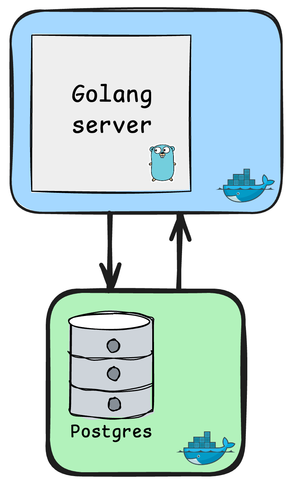

# go-api
Repo to learn about golang and play a bit with APIs using it.

This project is built using the Go programming language (Golang). Its primary goal is to deepen knowledge of the language through a hands-on approach.

Additionally, it serves as an experimental platform to apply and understand the concepts taught in the DevOps course at PUCPR.

# Tools being used
- **Golang**: The language to be used in this project in order to develop the API.
- **Postgres**: The database used to manage entities inside the API.
- **Docker**: Will be used to structure the database and the application inside containers for better execution and modularity.

# System Diagram

  

